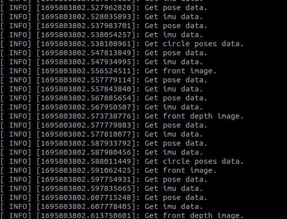
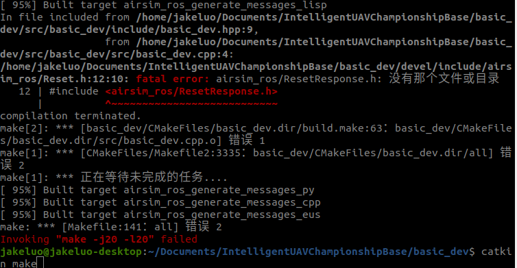

# release note:
## 20230926：规划控制专项赛基础开发环境

# __自主无人机竞速基本开发教程__  
1. ## 启动模拟器 
    参考 ***自主无人机竞速模拟器使用说明*** 配置好模拟器并启动

2. ## 安装Nvidia-Docker
    >确保已安装了 Nvidia 驱动
    ----
    >安装docker
    >+ `sudo apt-get install ca-certificates gnupg lsb-release`
    >+ `sudo mkdir -p /etc/apt/keyrings`
    >+ `curl -fsSL https://download.docker.com/linux/ubuntu/gpg | sudo gpg --dearmor -o /etc/apt/keyrings/docker.gpg`
    >+ `echo "deb [arch=$(dpkg --print-architecture) signed-by=/etc/apt/keyrings/docker.gpg] https://download.docker.com/linux/ubuntu $(lsb_release -cs) stable" | sudo tee /etc/apt/sources.list.d/docker.list > /dev/null`
    >+ `sudo apt-get update`
    >+ `sudo apt-get install docker-ce docker-ce-cli containerd.io docker-compose-plugin`
    ----
    >安装nvidia-container-toolkit
    >+ `distribution=$(. /etc/os-release;echo $ID$VERSION_ID)`
    >+ `curl -s -L https://nvidia.github.io/nvidia-docker/gpgkey | sudo apt-key add -`
    >+ `curl -s -L https://nvidia.github.io/nvidia-docker/$distribution/nvidia-docker.list | sudo tee /etc/apt/sources.list.d/nvidia-docker.list`
    >+ `sudo apt-get update && sudo apt-get install -y nvidia-container-toolkit`
    >+ `sudo systemctl restart docker`
    ---
    >设置用户组，消除 *sudo* 限制  
    >+ `sudo groupadd docker`  
    >+ `sudo gpasswd -a $USER docker`  
    >+ 注销账户并重新登录使新的用户组生效
    >+ sudo service docker restart

3. ## 安装ROS-Noetic 
    >+ `sudo sh -c 'echo "deb http://packages.ros.org/ros/ubuntu $(lsb_release -sc) main" > /etc/apt/sources.list.d/ros-latest.list'`   
    >+ `sudo apt install curl `  
    >+ `curl -s https://raw.githubusercontent.com/ros/rosdistro/master/ros.asc | sudo apt-key add -`   
    >+ `sudo apt update`
    >+ `sudo apt install ros-noetic-desktop-full`
    >+ `sudo apt install python3-catkin-tools`

4. ## 基于docker镜像的控制程序开发流程
    本次比赛中的模拟器使用 ***ROS*** 进行通讯，选手需要编写含有控制程序的ros功能包操控无人机完成目标,该ros功能包需要封装在docker镜像中进行提交。建议先在主机下开发完相应程序后在进行程序的docker封装，流程如下
    >进入文件目录  
    `cd /path/to/IntelligentUAVChampionshipBase/basic_dev`  
    >开发案例完成功能设计与程序开发并根据需要修改 _Dockerfile_ 后，构建镜像   
    `docker build -t basic_dev02 .`      
    >导出镜像  
    `docker image save [镜像：TAG] > test.tar`    
    在主机工作目录下会出现 test.tar 文件，该文件即为可提交镜像  
    ### 注意:  
    1. 服务器会在外部随机分配ip给容器，不能在镜像中的启动文件中提供 *ROS_IP* 和 *ROS_MASTER_URI* 这两个环境变量，否则服务器与容器将无法连接     
    2. 镜像中的程序应在镜像启动后自动开启  
    3. 镜像程序不允许使用GUI(X11等)功能，程序案例中的GUI程序仅供调试使用  

5. ## 程序案例
    ### 基础开发环境(basic_dev)
    #### 简介
    该镜像包含有ros-noetic-desktop-focal以及相关的必要ros组件。程序中展示了如何模拟器进行数据交互
    #### 使用说明
    >进入文件目录    
    `cd /path/to/IntelligentUAVChampionshipBase/basic_dev`  
    >构建镜像   
    `docker build -t basic_dev02 .`  
    >启动docker镜像   
    `./run_basic_dev.sh`  
    >当看到如下图，说明容器启动成功，程序可接受到模拟器传出的数据
    

6. ## ros数据交互
   
>用于获取数据的可订阅的主题  
>+ 前视相机   
`/airsim_node/drone_1/front_center/Scene`  
>+ 前视深度相机  
`/airsim_node/drone_1/front_left/DepthPlanar`
>+ imu数据  
`/airsim_node/drone_1/imu/imu`
>+ 无人机状态真值  
`/airsim_node/drone_1/pose_gt`
>+ 障碍圈位姿真值  
`/airsim_node/drone_1/circle_poses_gt`  
>+ 电机输入PWM信号(0:右前, 1:左后, 2:左前, 3:右后)  
`/airsim_node/drone_1/rotor_pwm`  
----
>用于发送指令的主题
>+ 角速度推力控制  
`/airsim_node/drone_1/angle_rate_throttle_frame`
>+ PWM控制  
`/airsim_node/drone_1/rotor_pwm_cmd`
----
>可用服务   
>+ 起飞   
`/airsim_node/drone_1/takeoff`   
>+ 降落   
`/airsim_node/drone_1/land`   
>+ 重置   
`/airsim_node/reset`

## Q&A
### 编译失败，显示缺失 airsim_ros 相关包
> 每个案例都包含有 _airsim_ros_ 包， 当使用 _catkin_make_时， 由于是多线程编译， _airsim_ros_ 还没编译完成导致案例包找不到，此时再次使用 _catkin_make_ 进行编译即可解决问题。
 

