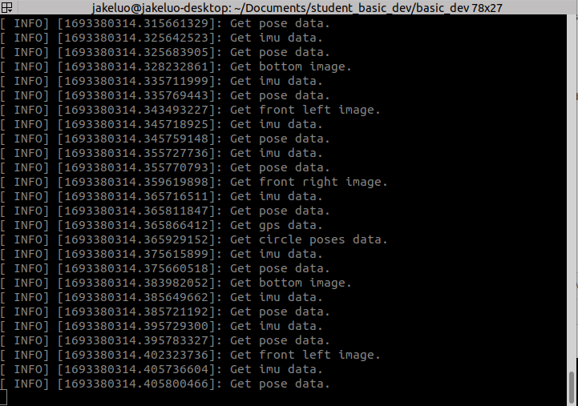
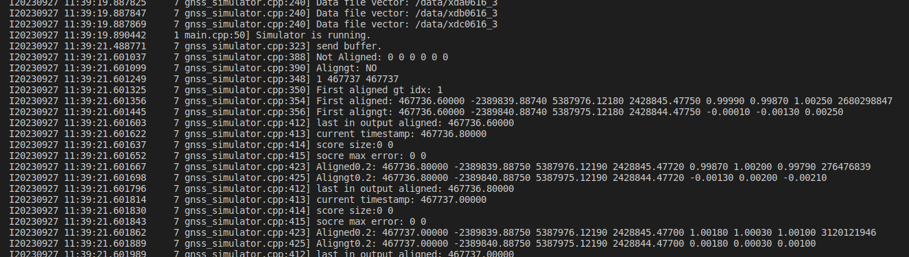
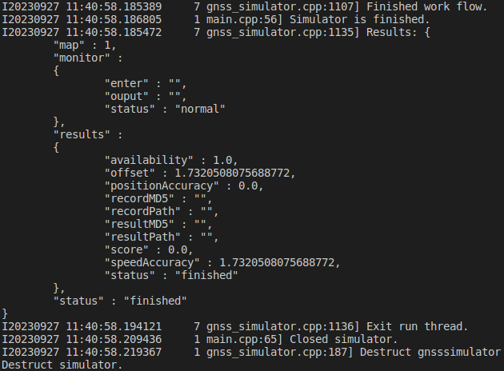
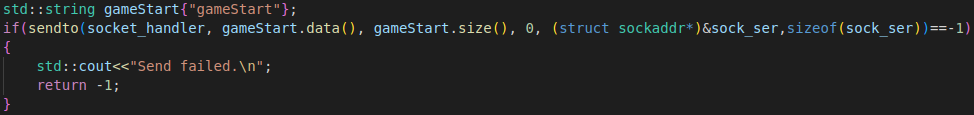
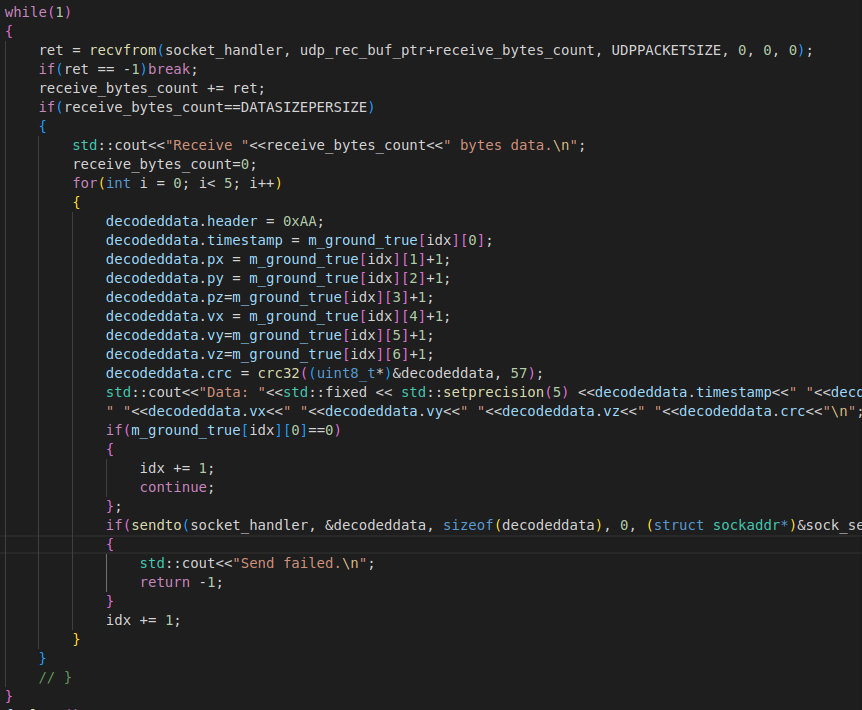
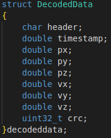
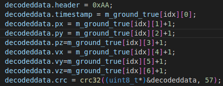
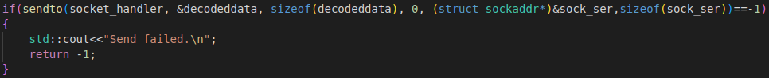
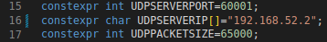
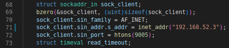

# release note:
## 20230926：GNSS模拟器基础开发案例
## 20231127：添加镜像提交说明

# __自主无人机竞速基本开发教程__  
1. ## 启动模拟器 
    参考 ***自主无人机竞速模拟器使用说明*** 配置好GNSS模拟器并启动

2. ## 安装Docker
    >安装docker
    >+ `sudo apt-get install ca-certificates gnupg lsb-release`
    >+ `sudo mkdir -p /etc/apt/keyrings`
    >+ `curl -fsSL https://download.docker.com/linux/ubuntu/gpg | sudo gpg --dearmor -o /etc/apt/keyrings/docker.gpg`
    >+ `echo "deb [arch=$(dpkg --print-architecture) signed-by=/etc/apt/keyrings/docker.gpg] https://download.docker.com/linux/ubuntu $(lsb_release -cs) stable" | sudo tee /etc/apt/sources.list.d/docker.list > /dev/null`
    >+ `sudo apt-get update`
    >+ `sudo apt-get install docker-ce docker-ce-cli containerd.io docker-compose-plugin`
    ----
    >设置用户组，消除 *sudo* 限制  
    >+ `sudo groupadd docker`  
    >+ `sudo gpasswd -a $USER docker`  
    >+ 注销账户并重新登录使新的用户组生效
    >+ sudo service docker restart

3. ## 基于docker镜像的控制程序开发流程
    本次比赛中的模拟器使用 ***UDP*** 进行通讯，选手需要根据接收到的 udp数据包，再每个10s周期内返回解码后的5个间隔为200ms的解算结果。该功能包需要封装在docker镜像中进行提交，建议先在主机下开发完相应程序后在进行程序的docker封装，流程如下
    >进入文件目录  
    `cd /path/to/IntelligentUAVChampionshipBase/basic_dev`  
    >开发案例完成功能设计与程序开发并根据需要修改 _Dockerfile_ 后，构建镜像   
    `docker build -t basic_dev .`      
    >导出镜像  
    `docker image save [镜像：TAG] > test.tar`    
    在主机工作目录下会出现 test.tar 文件，该文件即为可提交镜像  
    ### 注意:    
    镜像中的程序应在镜像启动后自动开启  

4. ## 程序案例
    ### 基础开发环境(basic_dev)
    #### 简介
    该镜像包含有udp数据接受的所有外围功能，并实现了再真值的基础上加1后返回给模拟器的案例程序。
    #### 使用说明
    >进入文件目录    
    `cd /path/to/IntelligentUAVChampionshipBase/`  
    >构建镜像   
    `docker build -t gnssdecoder .`  
    >启动docker镜像   
    `./run_gnssdecoder.sh`  
    >当看到如下图，说明容器启动成功，程序与模拟器开始交互  
      
    模拟器接收到开始信号后，开始处理数据    
    
    当模拟器结束任务时，如图所示展示有效帧率，整体位置偏置，位置精度，速度精度，和完成结果等数据。  
    
    #### 基本开发程序代码详解
    > 再进入循环接受数据之前，需要通过 udp 发送 _gameStart_ 字符串。模拟器接收到该字符串后，任务开始。  
        
    > 再while循环内，每一次接受到数据所需时间约为1.5s, 剩余8.5秒解算数据并返回5个数据。解码逻辑再 `if(receive_bytes_count==DATASIZEPERSIZE)`  内处理即可。此时_udp_rec_buf_ptr_ 内保存了 1s 的原始中频数据。  
      
    回传结果的数据结构为 _DecodedData_, _header_ 固定为 _0xAA_, _timestamp_, _px_, _py_, _pz_, _vx_, _vy_, _vz_ 为每个数据发送周期内结算得到的结果值。_crc_为上述变量值的校验码，再填完上述数值后，调用相关函数直接计算即可。      
      
      
    > 每一个解算结果需要调用udp接口发送回去。    
     

    ### 注意：
    每一个数据包发送过来后，无论解码成功与否都应该返回5个数据回模拟器中，可用默认值填充返回，否则模拟器会填充最大误差值进入缺失位。  

5. ## 提交说明
    >进入文件目录    
    `cd /path/to/IntelligentUAVChampionshipBase/`  
    >根据比赛要求完成算法程序  
    >构建镜像   
    `docker build -t gnssdecoder .`  
    >导出镜像  
    `docekr save gnssdecoder  > gnssdecoder.tar`  
    >gnssdecoder.tar 即为 可提交文件  

    ### 注意：
    >为方便调试，案例程序中给定的 UDPSERVERIP 与 UDPCLIENTIP 均为 127.0.0.1。赛事服务器这里分配给模拟器端的IP为 192.168.52.2，选手端IP为 192.168.52.3。再提交程序时，需要将这两个IP地址做相应改动。  
         
       
    >镜像不应主动退出，否则会导致服务器误判该镜像异常。  
